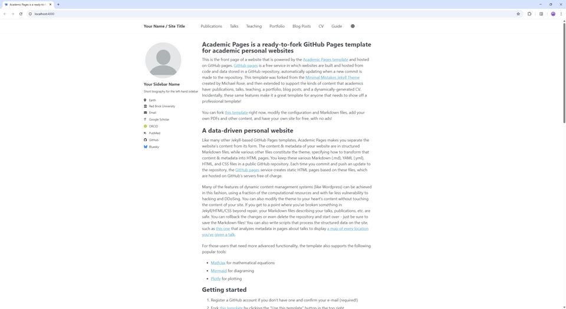

# danywaller.github.io

Personal website for Dany Waller: research portfolio, publications, poems, CV, and project pages.

This repository began as an [Academic Pages](https://academicpages.github.io/) site and is now a heavily modified fork maintained by Dany Waller ([@lunarswirls](https://github.com/lunarswirls)). The site still uses the Jekyll/Academic Pages foundation, but the content model, generators, layouts, and custom pages have been substantially reworked for this specific website.



## Repo Overview

- `_pages/`, `_publications/`, `_poems/`, `_portfolio/`, and `_teaching/` power the main site sections.
- `markdown_generator/` contains the BibTeX-driven publication generators, including both notebook and script workflows.
- `_data/cv.json` is used across the CV page and derived content such as the career map.
- `scripts/` contains repo-specific utilities for syncing and maintaining generated content.

## Running locally

When working on the site, it is useful to preview changes locally before pushing them to GitHub.

1. Clone the repository.
1. Install Ruby, Bundler, and Node.js.

### Using a different IDE

On most Linux distributions and [Windows Subsystem for Linux](https://learn.microsoft.com/en-us/windows/wsl/about):

```bash
sudo apt install ruby-dev ruby-bundler nodejs
```

If those packages cannot be located:

```bash
sudo apt update && sudo apt upgrade -y
sudo apt install ruby-dev ruby-bundler nodejs
```

On macOS:

```bash
brew install ruby
brew install node
gem install bundler
```

Install Ruby dependencies:

```bash
bundle install
```

If you hit gem permission issues, install gems locally instead:

```bash
bundle config set --local path 'vendor/bundle'
bundle install
```

Start the site locally with the helper script:

```bash
./preview.sh
```

This script:

- prefers a Homebrew Ruby install when available
- configures Bundler to use `vendor/bundle`
- runs `bundle install`
- starts `jekyll serve` at `http://localhost:4000`

If you prefer to run Jekyll directly, the equivalent command is:

```bash
bundle exec jekyll serve -H localhost
```

If you are running on Linux, you may also need:

```bash
sudo apt install build-essential gcc make
```

## Using Docker

If you prefer not to install local Ruby dependencies, you can use the provided `Dockerfile` and `docker-compose.yaml`:

```bash
chmod -R 777 .
docker compose up
```

The site should then be available at `http://localhost:4000`.

## Dev Container

If you use [Visual Studio Code](https://code.visualstudio.com/), the repository includes a Dev Container configuration. Reopen the repo in the container and VS Code will host the site locally on `http://localhost:4000`.

## Attribution

This site is based on [Academic Pages](https://github.com/academicpages/academicpages.github.io), which was forked from [Minimal Mistakes](https://mmistakes.github.io/minimal-mistakes/). This repository is no longer a drop-in copy of the template; it has been heavily customized by Dany Waller for a personal academic website and writing portfolio.

If you are looking for the original template and documentation, use the upstream Academic Pages project instead of this repository.

---
<div align="center">

[](https://github.com/danywaller/danywaller.github.io/graphs/contributors)
[](https://github.com/danywaller/danywaller.github.io)
[](https://github.com/danywaller/danywaller.github.io/fork)
[](https://github.com/danywaller/danywaller.github.io/blob/master/LICENSE)

</div>
